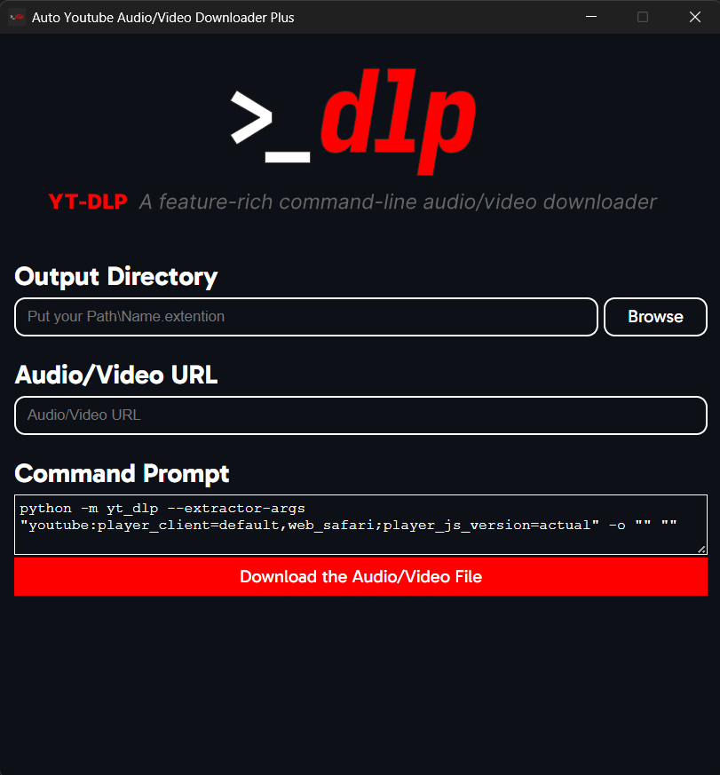

"A feature-rich command-line audio/video downloader" "...with a simple graphical interface".

# Content

- [How do i use it?](https://github.com/SubFabula/auto-yt-dlp?tab=readme-ov-file#how-do-i-use-it)
- [Can i contribute to this?](https://github.com/SubFabula/auto-yt-dlp?tab=readme-ov-file#can-i-contribute-to-this)
- [Report an Issue](https://github.com/SubFabula/auto-yt-dlp/issues/new)
> [!NOTE]
> I have left logging on by default. So, once you run the app, there will be a `auto_yt_dlp.log` file created in the module folder. If you have any errors or problems, provide the log file as well. Some errors might not have been saved to the log file, make sure to check the console and copy the errors from there too.
- [Other Q&As](https://github.com/SubFabula/auto-yt-dlp/discussions/new/choose)

## How do i use it?
For now, just follow these steps to use this app. (I will figure out how to put this to PyPi when i have some free time.)

1. Download just the [`auto_yt_dlp`](https://github.com/SubFabula/auto-yt-dlp/tree/main/auto_yt_dlp) module to your machine.

2. Assuming you have [`Python`](https://www.python.org/downloads), locate your `Python` folder, and then go into the `libs` folder (the separate one would also do if you have that).

3. Now, put the downloaded module into the `libs`. And open command prompt `(Ctrl + R -> cmd)`.

4. If everything is working as indented, when you enter `python -m auto_yt_dlp` in the command prompt, the app wil start.

> [!NOTE]
> Note that if you get any errors in the Command Output, it's probably something to do with [`yt-dlp`](https://github.com/yt-dlp/yt-dlp) or the way you wrote your URL or Output Path.

> [!WARN]
> If you are manually setting your path, dont forget to write the file name and extention at the end of the folder directroy.

Example:
`C:\Users\\[USERNAME]\Desktop\\[FILE_NAME].[FILE_EXTENTION]`

Another example:
`C:\Users\myPC\Desktop\FunnyVideo.mp4`

## Can i contribute to this?
Yes, you can. ^And also thanks, i really appreciate it :D

How?

In whatever you think you can by adding any missing features (by forking it), telling me any mistakes/errors an whatnot from the [issiues](https://github.com/SubFabula/auto-yt-dlp/issues) or localizing it to your native language or to the ones you know (just make a fork and translate it. I will do the in-app language settings stuff later.)

# TODO
- [x] Make the app launch-able from CMD.
- [x] Make the app and CMD exit together.
- [x] Desing the UI(WIP but whatever).
- [x] Make the app input CMD codes and run it (after the UI is done, somewhat, which is now).
- [ ] Upload to PyPi for others to be able to use it easily(is it just me or is the process a bit complicated?).
- [ ] Add every other option of [`yt-dlp`](https://github.com/yt-dlp/yt-dlp).